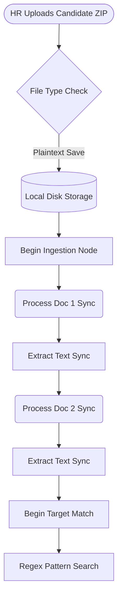
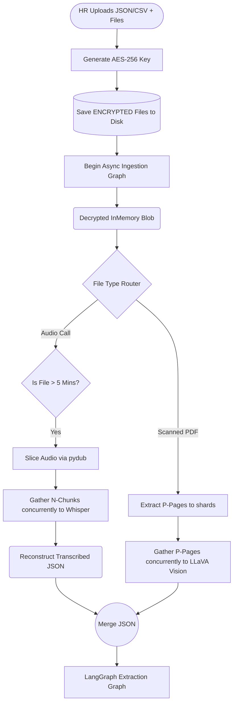

# OnboardGuard Architecture Evolution

This document serves as the canonical map tracing the evolution of the OnboardGuard extraction, routing, and security architecture during the Phase 3 & 4 Modernization cycles.

## 1. The Core Problems (Legacy Architecture)
The previous state of the `Recro` validation application suffered from four primary bottlenecks that crippled its ability to run as an enterprise-grade solution:

1. **Synchronous Blocking:** The entire execution layer from document parsing (OCR) to LLM semantic matching ran sequentially. If HR uploaded 6 heavy resumes, the system waited for Document A to completely finish reading before it even looked at Document B.
2. **Brittle Extraction (Regex):** LangGraph nodes were generating raw text strings from the LLM and forcing standard Python `Regex` handlers to try and fish out dictionary keys (e.g. `re.search("CTCC: (\d+)")`). This is highly fragile.
3. **Data Localization Risk:** Aadhar/PAN files and Resumes containing explicitly sensitive Personal Identifiable Information (PII) were dropped into the `/uploads/` directory in plain-text. If the server was compromised, all applicant physical documents were instantly breached.
4. **Shallow AI Processing:** Multi-page scanned documents would only ever analyze `page_1` due to HTTP blocking fears. Heavy Audio calls from HR would crash if they exceeded Whisper's 25MB limits.

---

## 2. Advanced Mitigation Strategies (Current State)

### A. The "Encryption at Rest" Funnel
Uploaded physical files are now intercepted at the FastAPI `upload.py` layer. A symmetric `AES-256 Fernet` cipher key dynamically encrypts the file byte stream natively *before* it is saved to disk. 
During the LangGraph ingestion phase, `tools.py` utilizes a secure context-manager (`decrypted_tempfile`) which decrypts the bytes directly into local system RAM, processes the OCR or Transcription, and instantly shreds the temporary shard—so plaintext data never lives statically on the server.

### B. Structured Enforced Outputs
We have ripped out Regex parsing. Using Groq's `response_format={"type": "json_object"}`, the LLM is forcibly restricted at the compiler-level to output pure canonical JSON strings. 

### C. Massively Parallelized OCR & Audio Chunking
The system now maps array structures. Instead of reading a 10-page document simultaneously, `pdf2image` drops all 10 pages as shards. We fire 10 concurrent `asyncio.gather` requests at the Groq Vision model, drastically dropping a 15-second process down to 2-seconds flat. For Audio, `pydub` dynamically checks length and slices HR calls into parallel 5-minute chunks for Whisper.

> [!TIP]
> **API Resiliency:** To prevent HTTP 429 Rate Limits from Groq when firing 10 page-requests at exactly the same millisecond, the `LLMService` utilizes `@retry` decorators via `tenacity` with exponential backoff timers.

---

## 3. Workflow Comparison Diagrams

### Legacy Data Flow (Synchronous)

### Modern Data Flow (Asynchronous Array Chunking)

