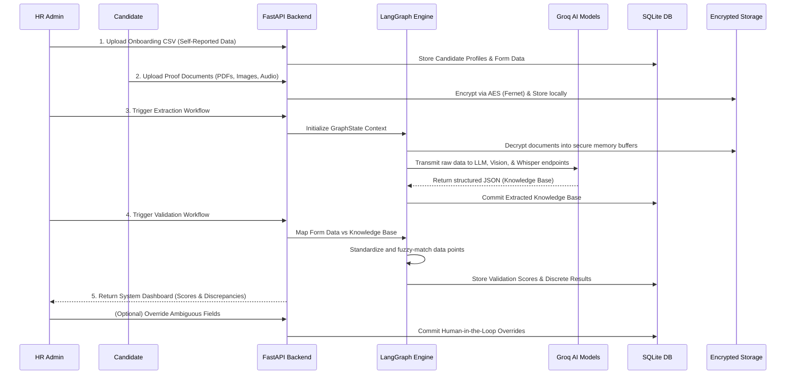
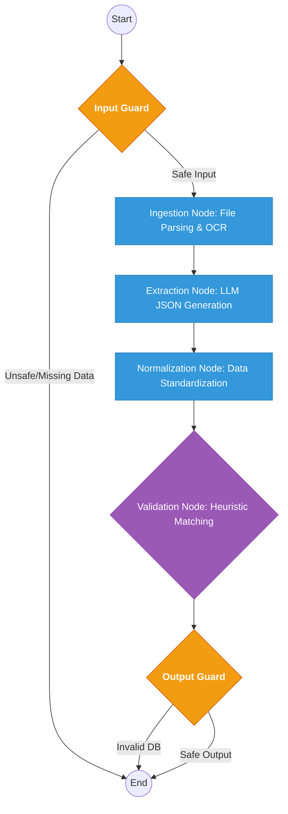

# OnboardGuard: System Architecture & Workflow Specifications

## Executive Summary
OnboardGuard is an enterprise-grade, AI-driven candidate onboarding validation system. It is designed to autonomously cross-reference self-reported candidate data (received via structured forms) against physical ground-truth documents (resumes, government IDs, marksheets, and audio transcripts) to detect discrepancies and minimize manual HR verification efforts.

---

## 1. High-Level System Architecture

The ecosystem operates on a modular, decoupled architecture consisting of four primary tiers: the Presentation Layer, the Application Layer, the Data & Security Layer, and the AI Inference Layer.

*(Note: Mermaid beta architecture diagrams provide spatial visualization of the infrastructure)*

---

## 2. Core Validation Workflow

The sequential data flow follows a strict graph-based lifecycle driven by the **LangGraph Orchestration Engine**.

---

## 3. LangGraph Subgraph Execution Flow

The heart of the system is the intelligent state-machine graph (`app/langgraph/orchestration.py`) that governs the AI agents and heuristics. Execution is highly deterministic.

---

## 4. Component Deep Dive

### 4.1. Data Ingestion & Cryptographic Security
* **Responsibility:** Securely handle raw data streams from the edge to the server.
* **Mechanism:** Upon upload, physical documents are intercepted and immediately encrypted at rest using **Fernet symmetric cryptography (AES)**. When a document must be processed, a context manager (`decrypted_tempfile`) securely mounts a decrypted slice into temporary memory and automatically shreds the payload from memory upon completion to ensure stringent PII protection.

### 4.2. LangGraph Orchestration Engine
* **Responsibility:** Maintain the unified `GraphState` across distributed asynchronous operations.
* **Mechanism:** 
  * Replaces fragile procedural code with a directed acyclic graph (DAG). 
  * Allows parallel concurrent execution (multi-threading extraction tasks across resumes and marksheets simultaneously).
  * Enforces state constraints via an `input_guard` and `output_guard` to preemptively detect corruption.

### 4.3. AI Extraction Service
* **Responsibility:** Convert unstructured or multi-modal contextual data into precise, predictable JSON schemas.
* **Mechanism:** 
  * Interfaces with Groq's high-speed inference engine.
  * Dynamically routs requests based on file type:
    * **Standard PDFs/Text:** `openai/gpt-oss-120b` (Standard instruction models)
    * **Scanned Government IDs (Aadhar/PAN):** `meta-llama/llama-4-scout` (Groq Vision Models)
    * **HR Audios:** `whisper-large-v3-turbo` (Speech-to-text integration with automated file chunking).

### 4.4. Heuristic Validation Engine
* **Responsibility:** Analyze relationships between self-reported structured data and the newly generated AI knowledge base.
* **Mechanism:** 
  * Iterates through all extracted metadata and compares fields using normalization formatting.
  * Grades every field into a strict schema: **CORRECT**, **INCORRECT**, or **AMBIGUOUS**.
  * Outputs an algorithmic trust threshold (validation score percentages).

### 4.5. Human-in-the-Loop (HITL) Framework
* **Responsibility:** Manage systemic edge cases and enforce administrative authority.
* **Mechanism:** Any flagged mismatches (or ambiguous predictions derived from fuzzy parsing logic) are highlighted in the React SPA. A reviewing officer interacts exclusively with the outliers, forcing specific overrides and updating database telemetry without re-running the heavy AI inference pipelines.
