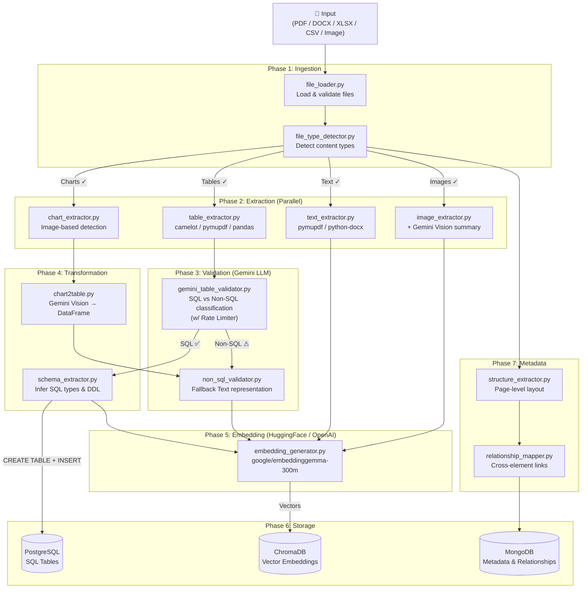

# 🧪 Data Extraction Pipeline — Architecture & Explanation

> A complete, modular pipeline for extracting structured and unstructured data from heterogeneous documents, classifying it, and storing it across relational, vector, and NoSQL databases.

---

## 1. System Overview

This system takes in **heterogeneous data sources** (PDF, DOCX, XLSX, CSV, Images) and performs:

1. **Content Detection** — What's inside the file? (Tables? Charts? Text? Images?)
2. **Parallel Extraction** — Extract each content type concurrently.
3. **LLM Validation** — Gemini classifies tables as SQL-compatible or Non-SQL.
4. **Transformation** — Charts → tables, schema inference for SQL tables.
5. **Embedding** — OpenAI generates vector embeddings for all content.
6. **Resilience** — Automatic Retry mechanism (exponential backoff) for API limits.
7. **Fallback Handling** — If SQL classification fails/timeouts, data is automatically saved as Unstructured (Non-SQL) to prevent data loss.
8. **Multi-Store Persistence** — Data lands in the right database (Postgres for SQL, Chroma/Mongo for Unstructured).

---

## 2. Architecture Diagram



---

## 3. Detailed Phase Breakdown

### Phase 1: Ingestion

| Module | What It Does |
|---|---|
| `file_loader.py` | Loads single files or recursively loads all supported files from a directory. Returns `LoadedFile` objects with raw bytes and metadata. |
| `file_type_detector.py` | Analyzes each file using **lightweight heuristics** (not full extraction) to build a `ContentProfile`. For PDFs: page-by-page text length, image count, and tabular patterns. |

**Output**: `ContentProfile` with boolean flags: `has_tables`, `has_charts`, `has_text`, `has_images`.

---

### Phase 2: Extraction (Parallel)

All 4 extractors run **concurrently** using `utils/parallel.py` (ThreadPoolExecutor).

| Module | Input | Output | Libraries |
|---|---|---|---|
| `text_extractor.py` | PDF/DOCX/CSV bytes | Page-level text + concatenated full text | `pymupdf`, `python-docx`, `pandas` |
| `table_extractor.py` | PDF/DOCX/XLSX bytes | `ExtractedTable` objects (DataFrame + metadata) | `camelot`, `pymupdf`, `pandas` |
| `image_extractor.py` | PDF/DOCX/Image bytes | `ExtractedImage` objects + **Gemini Vision summaries** (Rate Limited) | `pymupdf`, `python-docx`, Gemini API |
| `chart_extractor.py` | PDF/XLSX bytes | `ExtractedChart` objects (chart images) | `pymupdf`, `openpyxl` |

---

### Phase 3: Validation (Gemini LLM)

| Module | Decision | Action |
|---|---|---|
| `gemini_table_validator.py` | **SQL** (confidence > threshold) | → Schema extraction → PostgreSQL |
| `gemini_table_validator.py` | **Non-SQL** | → Text representation → Embeddings |
| `non_sql_validator.py` | Detects key-value / irregular / multi-header type | Converts to flat text for embedding |

**Resilience**: Uses `utils.gemini_helper.py` to handle Rate Limits (429 errors) with exponential backoff retries.
**Fallback**: If the API call fails after retries (e.g., rate limit exhaustion), the table is automatically treated as **Non-SQL (Unstructured)** to ensure data is saved.

**Gemini Prompt**: Receives table headers, sample rows, and column count. Returns JSON verdict with confidence score, reasoning, and suggested SQL types.

---

### Phase 4: Transformation

| Module | Input | Output |
|---|---|---|
| `chart2table.py` | Chart image bytes | `pandas.DataFrame` (via Gemini Vision analysis, Rate Limited) |
| `schema_extractor.py` | `ExtractedTable` + `TableClassification` | SQL schema (`CREATE TABLE` DDL) + column type map |

---

### Phase 5: Embedding (OpenAI)

| Feature | Detail |
|---|---|
| Provider | `huggingface` (default, local) or `openai` (API) |
| Default Model | `google/embeddinggemma-300m` |
| Dimensions | 768 (configurable) |
| Pooling | Mean pooling over token embeddings |
| Chunking | Auto-splits texts > 6000 chars on paragraph boundaries |
| Aggregation | Multi-chunk texts get averaged embeddings |
| Device | CPU / CUDA / MPS (configurable via `HF_DEVICE`) |

**What gets embedded:**
- SQL table schemas
- Non-SQL table text representations
- Charts converted to tabular text
- Raw document text
- Image summaries from Gemini Vision

---

### Phase 6: Storage

| Database | What Goes In | Why |
|---|---|---|
| **PostgreSQL** | SQL-compatible table data (rows + schema) | Relational querying, joins, aggregations |
| **ChromaDB** | All embeddings + source documents | Semantic search, RAG retrieval, similarity matching |
| **MongoDB** | Document metadata, page structures, relationships | Flexible schema for nested structural metadata |

---

### Phase 7: Metadata

| Module | What It Captures |
|---|---|
| `structure_extractor.py` | Per-page layout: what elements (tables, images, charts, text) exist on each page with counts and previews |
| `relationship_mapper.py` | Cross-element links: same-page co-occurrence, chart↔table proximity, text referencing tables |

---

## 4. Configuration

All settings live in `.env` — **nothing is hardcoded**.

```
GEMINI_API_KEY=                # LLM for validation & vision
GEMINI_MODEL=gemini-2.0-flash

EMBEDDING_PROVIDER=huggingface  # or 'openai'
OPENAI_API_KEY=                # Only if provider=openai
EMBEDDING_MODEL=google/embeddinggemma-300m
EMBEDDING_DIMENSIONS=768
HF_DEVICE=cpu                  # cpu / cuda / mps

POSTGRES_URI=postgresql://...  # SQL tables
MONGO_URI=mongodb://...        # Metadata
CHROMA_PERSIST_DIR=./chroma_db # Vectors

MAX_WORKERS=4                  # Parallel extraction threads
LOG_LEVEL=INFO
```

---

## 5. Running the Pipeline

```bash
# Single file
python main.py --input ./sample_data/report.pdf

# Entire directory
python main.py --input ./sample_data/

# JSON output
python main.py --input ./sample_data/ --json
```

---

## 6. Technology Stack

| Component | Technology | Role |
|---|---|---|
| LLM | **Gemini 2.0 Flash** | Table validation, image summaries, chart-to-table |
| Embeddings | **HuggingFace** (`google/embeddinggemma-300m`) | Local vector generation (free, no API key) |
| PDF Engine | **PyMuPDF** (fitz) | Text, image, table extraction |
| Table Detection | **Camelot** | Lattice + stream table detection |
| Vector DB | **ChromaDB** | Persistent local vector storage |
| SQL DB | **PostgreSQL** + SQLAlchemy | Dynamic schema creation + data storage |
| NoSQL DB | **MongoDB** + PyMongo | Metadata and relationship storage |
| Concurrency | **asyncio** + ThreadPoolExecutor | Parallel extraction |
| Rate Limiter | **Wait & Retry** (Exponential Backoff) | Handles Gemini 429 errors gracefully |
| Logging | **Rich** | Beautiful console output |
