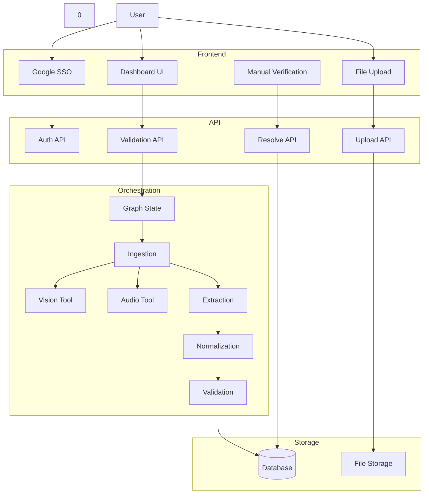

# 🛡️ OnboardGuard - AI-Based Onboarding Validation System

OnboardGuard is a production-ready system that automates the verification of candidate onboarding documents. It uses a **LangGraph** orchestration pipeline to ingest, extract, and validate structured form data (CSV/Excel) against unstructured proofs (Aadhar, PAN, Marksheets, Resumes) using **Groq's Llama-3.3** and **Llama-Vision** models.

---

## 🏗️ System Architecture

The system follows an **Event-Driven, Graph-Based** architecture. The core logic is decoupled from the API, managed by LangGraph.



---

## 🚀 How It Works (The Flow)

1. **HR Uploads Onboarding Form**: A CSV/Excel file containing candidate details (Name, Email, Offer Info) is uploaded. Candidates are created in the database.
2. **HR Uploads Documents**: Proofs like Aadhar, PAN, 10th/12th Marksheets, and Resumes are uploaded for a specific candidate.
3. **Ingestion (Multimodal)**:
   * **PDFs/Docs**: Text is extracted using `pypdf` or `python-docx`.
   * **Images (Aadhar/PAN)**: Passed to **Llama-3.2-Vision** on Groq for high-accuracy OCR.
   * **Audio (Interview Rec)**: Transcribed using **Whisper-large-v3**.
4. **Extraction (AI)**:
   * Raw text is sent to **Llama-3.3-70b** with specific prompts to extract structured JSON (e.g., `{"aadhar_number": "XXXX-1234", "dob": "2000-01-01"}`).
5. **Normalization**:
   * Dates are standardized to `YYYY-MM-DD`.
   * Field names are canonicalized (e.g., "Mobile No" -> `phone`).
   * Irrelevant fields (Consent, Captcha) are discarded.
6. **Validation (Logic)**:
   * **Strict Mode**: IDs and Genders must match EXACTLY.
   * **Smart Match**: "B.Tech" matches "Bachelor of Technology".
   * **Persistence**: If you previously marked a field as "Correct" manually, the system respects that decision forever.

---

## ⚡ Quick Start

### 1. Prerequisites

- **Groq API Key**: Get one from [console.groq.com](https://console.groq.com).

### 2. Backend Setup

```bash
cd backend
python3 -m venv venv
source venv/bin/activate
pip install -r requirements.txt

# Create .env file
cp .env.example .env
# Edit .env and add GROQ_API_KEY
```

### 3. Frontend Setup

```bash
cd frontend
npm install
npm run build
```

### 4. Run System

```bash
# Starts Backend (FastAPI) which also serves the Frontend
# From backend/ directory:
uvicorn app.main:app --reload --host 0.0.0.0 --port 8000
```

Open **[http://localhost:8000](http://localhost:8000)**

---

## 🛠️ Technology Stack

| Component               | Tech                                         | Why?                                                      |
| :---------------------- | :------------------------------------------- | :-------------------------------------------------------- |
| **Backend**       | **FastAPI**                            | Async performance, auto-docs, type safety.                |
| **Orchestration** | **LangGraph**                          | Managing complex state across Ingestion/Extraction steps. |
| **LLM Inference** | **Groq**                               | The fastest inference engine today.                       |
| **Models**        | **Llama-3.3** & **Llama-Vision** | SOTA open-source models for reasoning and OCR.            |
| **Database**      | **SQLAlchemy + SQLite**                | Lightweight, relational persistence.                      |
| **Frontend**      | **React + Vite**                       | Modern, fast SPA with component-based architecture.       |

---

## 📂 Project Structure

```bash
├── backend/
│   ├── app/
│   │   ├── api/          # Endpoints (Auth, Upload, Validate)
│   │   ├── langgraph/    # The Graph Logic
│   │   │   ├── orchestration.py # Main Pipeline Wrapper
│   │   │   ├── subgraphs/       # Individual Nodes (Ingestion, Validation)
│   │   │   └── state.py         # Shared Data Schema
│   │   └── services/     # LLM Service (Groq Wrapper)
│   ├── uploads/          # Local file storage
│   └── main.py           # App Entry Point
└── frontend/             # Standard React+Vite Structure
```

# Technical Validaton Flow

## 1. System Overview

**OnboardGuard** is an event-driven, graph-based validation system. It uses **LangGraph** to orchestrate a pipeline of specialized nodes (Ingestion → Extraction → Normalization → Validation).

## 2. Request Flow (Entry to Exit)

### Step 1: API Entry Point

**File**: `backend/app/main.py`

- Request hits `POST /api/v1/validate/{candidate_id}`
- Routed to `backend/app/api/routes/validation.py`

### Step 2: Validation Route Handler

**File**: `backend/app/api/routes/validation.py`
**Function**: `validate_candidate`

1. Fetches Candidate from DB.
2. Loads `kb` (Knowledge Base - extracted from docs).
3. Loads `form` (Onboarding Form Data).
4. Fetches `existing_validation` (to preserve manual overrides).
5. **TRIGGER**: Calls `run_validation_workflow(kb, form, existing_validation)`.

### Step 3: Orchestration (The "Brain")

**File**: `backend/app/langgraph/orchestration.py`
**Function**: `run_validation_workflow`

- Initializes `GraphState` with inputs.
- Executes the graph: `Normalization Node` → `Validation Node`.

### Step 4: Normalization Node

**File**: `backend/app/langgraph/subgraphs/normalization.py` (implied loc)

- **Goal**: Clean form data.
- **Tools**: `backend/app/langgraph/subgraphs/validation/tools.py`
  - `normalize_form_data()`:
    - Drops irrelevant fields (Emergency contact, Consent, etc.) using `IGNORE_FIELDS` + `IGNORE_PATTERNS`.
    - Canonicalizes keys (e.g., `Email ID` → `email`).

### Step 5: Validation Node (The Core Logic)

**File**: `backend/app/langgraph/subgraphs/validation/graph.py`
**Function**: `validation_node`

#### 5.1 PREPARATION

- **Manual Overrides**: Checks `existing_validation` in state. If a field was manually marked `CORRECT`/`INCORRECT`, it LOCKS that status and skips auto-validation.
- **KB Flattening**: Calls `_build_flat_kb`.
  - Flattens nested KB (e.g., `marksheet_10th` → `school_name`).
  - Adds source prefixes (e.g., `10th_school_name`) to prevent cross-matching with 12th/Degree.

#### 5.2 LOOKUP

- **File**: `backend/app/langgraph/subgraphs/validation/tools.py`
- **Table**: `KB_FIELD_LOOKUP`
- **Logic**: For each form field (e.g., `aadhar_number`), looks up EXACT mapped keys in KB.
  - *Critical Fix*: No fuzzy guessing. `degree` will NEVER match `full_name`.

#### 5.3 COMPARISON (Smart Matching)

- **Function**: `values_match` inside `tools.py`.
- **Logic**:
  - **Gender**: STRICT equality (No "Male" substring in "Female").
  - **IDs (Aadhar/PAN)**: STRICT alphanumeric check. Masking support (`XXXX-1234` matches `1234`).
  - **Dates**: Normalized to `YYYY-MM-DD` before comparing.
  - **Education**: Degree abbreviation expansion (`B.E.` = `Bachelor of Engineering`).
  - **Address/Name**: Word overlap & city-level matching.

#### 5.4 RESULT

- Returns list of validations with status: `CORRECT`, `INCORRECT`, `AMBIGUOUS`.
- Adds `reason` string explaining why.

### Step 6: Response & Persistence

- Graph returns results to `validation.py`.
- **Validation Route**:
  1. Calculates new score.
  2. Updates `Candidate` record in DB.
  3. Returns JSON response to Frontend.

---

## 3. Resolving Ambiguity (Feedback Loop)

**Flow when user clicks "Mark Correct"**:

1. **Frontend**: Calls `POST /api/v1/resolve/{candidate_id}` with `{field, resolution: 'CORRECT'}`.
2. **Backend**: `backend/app/api/routes/validation.py` (`resolve_ambiguous`).
   - Updates the specific field in validation JSON blob.
   - Sets reason to `"Manually marked as CORRECT..."`.
   - **Commits to DB**.
3. **Next Validation Run**:
   - Step 5.1 detects this "Manually marked" reason and preserves it.

---

## 4. Key Configuration

**File**: `backend/app/core/config.py`

- `GROQ_API_KEY`: For LLM/Vision.
- `VISION_MODEL`: `meta-llama/llama-4-scout-17b-16e-instruct` (OCR).
- `WHISPER_MODEL`: `whisper-large-v3-turbot` (Transcribe).
- `LLM_MODEL`: `llama-3.3-70b-versatile` (Extraction).
