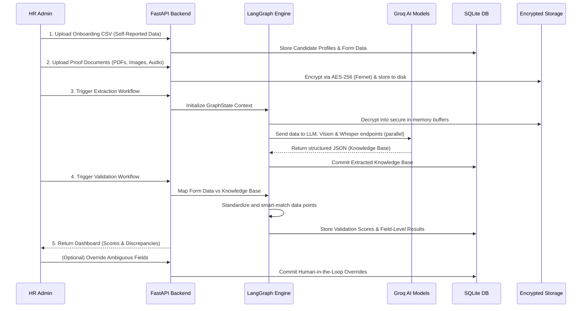
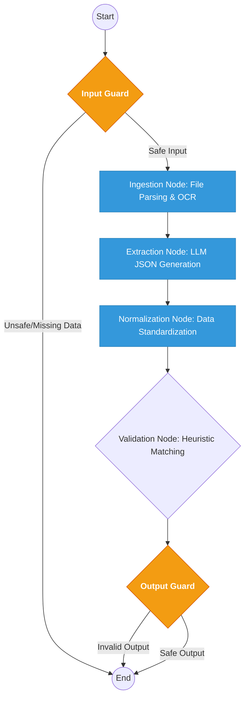

# OnboardGuard — AI-Based Candidate Onboarding Validation System

OnboardGuard is a production-ready, enterprise-grade system that automates the verification of candidate onboarding documents. It uses a **LangGraph** orchestration pipeline to ingest, extract, and validate structured form data (CSV/Excel) against unstructured proof documents (Aadhar, PAN, Marksheets, Resumes, HR Audio) using **Groq's Llama-3.3**, **Llama-Vision**, and **Whisper** models.

---

## Table of Contents

1. [System Architecture](#1-system-architecture)
2. [How It Works — The Full Flow](#2-how-it-works--the-full-flow)
3. [LangGraph Orchestration Engine](#3-langgraph-orchestration-engine)
4. [Component Deep Dive](#4-component-deep-dive)
5. [Validation Logic](#5-validation-logic)
6. [Human-in-the-Loop (HITL) Feedback Loop](#6-human-in-the-loop-hitl-feedback-loop)
7. [Enterprise Upgrades & Modernization](#7-enterprise-upgrades--modernization)
8. [Errors, Vulnerabilities & Mitigations](#8-errors-vulnerabilities--mitigations)
9. [Frontend Architecture](#9-frontend-architecture)
10. [Technology Stack](#10-technology-stack)
11. [Project Structure](#11-project-structure)
12. [Quick Start](#12-quick-start)
13. [Key Configuration](#13-key-configuration)

---

## 1. System Architecture

The system operates on a **modular, decoupled, event-driven** architecture with four primary tiers:


---

## 2. How It Works — The Full Flow



### Step-by-Step Breakdown

**Step 1 — HR Uploads Onboarding Form**: A CSV/Excel file with candidate details (Name, Email, DOB, Offer Info, etc.) is uploaded. Candidate records are created in the database.

**Step 2 — HR Uploads Documents**: Proof files (Aadhar, PAN, 10th/12th Marksheets, Resumes, HR Audio) are uploaded per candidate. Files are immediately AES-256 encrypted before hitting the disk.

**Step 3 — Ingestion (Multimodal)**:
- **PDFs/Docs**: Text extracted via `pypdf` / `python-docx`.
- **Multi-page Scanned PDFs**: All pages converted to image shards via `pdf2image`, then passed concurrently to **Llama-4-Scout Vision** via `asyncio.gather()`.
- **Images (Aadhar/PAN)**: Passed to **Llama-Vision** on Groq for high-accuracy OCR.
- **Audio (HR Interviews)**: Files under 5 min go directly to **Whisper-large-v3-turbo**. Files exceeding the 25MB Whisper limit are sliced into sub-5-minute chunks via `pydub`, transcribed in parallel, and stitched back together.

**Step 4 — Extraction (AI)**: Raw text is sent to **Llama-3.3-70b** with targeted prompts. The API is called with `response_format={"type": "json_object"}`, enforcing clean structured JSON output — eliminating Regex fragility entirely.

**Step 5 — Normalization**:
- Dates standardized to `YYYY-MM-DD`.
- Field names canonicalized (e.g., `"Email ID"` → `email`).
- Irrelevant fields (Consent, Emergency Contact, Captcha) stripped via `IGNORE_FIELDS` + `IGNORE_PATTERNS`.

**Step 6 — Validation**: Form data compared against the AI Knowledge Base field-by-field. Results classified as `CORRECT`, `INCORRECT`, or `AMBIGUOUS` with an explanatory `reason` string.

---

## 3. LangGraph Orchestration Engine

The core graph (`backend/app/langgraph/orchestration.py`) is a directed acyclic graph (DAG) with deterministic routing:



**LangGraph subgraph structure:**

```
backend/app/langgraph/
├── state.py                  ← Shared GraphState schema
├── orchestration.py          ← Main pipeline wrapper
└── subgraphs/
    ├── ingestion/
    │   ├── graph.py          ← File parsing, OCR, transcription
    │   └── tools.py          ← Groq Vision, pdf2image, pydub, decrypted_tempfile
    ├── extraction/
    │   └── graph.py          ← Async LLM parallel extraction
    ├── normalization/
    │   └── __init__.py       ← Field canonicalization & junk filter
    ├── validation/
    │   ├── graph.py          ← Smart matching, auditable results
    │   └── tools.py          ← KB_FIELD_LOOKUP, values_match(), abbreviation maps
    └── guardrails/
        └── guards.py         ← Input/output safety checks
```

**Parallel async execution** uses `asyncio.gather()` with an `asyncio.Semaphore(2)` throttle. An exponential backoff `@retry` via `tenacity` handles transient `HTTP 429` rate-limit errors from Groq.

---

## 4. Component Deep Dive

### 4.1 Data Ingestion & Cryptographic Security

Files are intercepted at `upload.py` and encrypted using **AES-256 Fernet** symmetric ciphering **before** being written to disk. During LangGraph processing, the `decrypted_tempfile` context manager decrypts data into volatile RAM, performs OCR/transcription, then instantly shreds the memory buffer — plain-text PII never persists on disk.

### 4.2 AI Extraction Service

Model routing by file type:

| Input Type | Model |
|---|---|
| Standard PDFs / Text | `llama-3.3-70b-versatile` |
| Scanned Government IDs (Aadhar/PAN) | `meta-llama/llama-4-scout-17b-16e-instruct` |
| HR Audio / Interview Recordings | `whisper-large-v3-turbo` |

All extraction calls enforce `response_format={"type": "json_object"}` — output is parsed directly with `json.loads()`, reducing extraction mapping errors to zero.

### 4.3 Heuristic Validation Engine

Located at `backend/app/langgraph/subgraphs/validation/graph.py`.

- Uses `KB_FIELD_LOOKUP` for deterministic field-to-KB mapping — `degree` will never cross-match with `full_name`.
- Flattens nested KB with source prefixes (`10th_school_name`, `12th_school_name`) to prevent cross-document matching.
- Grades every field: **CORRECT**, **INCORRECT**, or **AMBIGUOUS** with a `reason` string.
- Computes a percentage **validation score** for the overall candidate.

### 4.4 Human-in-the-Loop (HITL) Framework

Flagged fields surface in the React dashboard. HR reviewers manually override statuses. Overrides are committed with a `"Manually marked"` reason tag and respected permanently on all future validation runs.

### 4.5 Document Forensics — Anti-Fraud Shield

`pypdf` scans PDF EXIF metadata on upload. If graphic design software fingerprints are found (`/Producer Adobe Photoshop`, `Illustrator`, `Canva`), a **Forensic Strike** is logged and the frontend renders a pulsing `TAMPER RISK [High]` alert.

### 4.6 Zero-Trust PII Auto-Redaction

When a recruiter requests to view a document:
1. AES cipher is decrypted into volatile memory only.
2. `PyMuPDF` locates all Aadhar (12-digit) and PAN (10-char) sequences via bounding boxes.
3. Black redaction blocks are painted over them.
4. The redacted PDF is served to the browser — sensitive strings never reach the frontend in plain text.

---

## 5. Validation Logic

### Smart Matching (`values_match()` in `tools.py`)

| Field Type | Strategy |
|---|---|
| **Aadhar / PAN IDs** | Strict alphanumeric; masking support (`XXXX-1234` matches `1234`) |
| **Gender** | Strict equality (prevents "Male" substring match inside "Female") |
| **Dates** | Normalized to `YYYY-MM-DD` before comparison |
| **Degrees** | Abbreviation expansion (`B.E.` = `Bachelor of Engineering`, `B.Tech` = `Bachelor of Technology`) |
| **Names / Addresses** | Word overlap & city-level fuzzy matching |
| **Semantic Fallback** | `difflib.SequenceMatcher` — score > 80% validates with **"AI Semantic Match"** badge |

### Manual Overrides — Persistence

Fields can only be locked by the HITL framework. On each validation run, Step 5.1 checks `existing_validation` in the GraphState. Fields with `"Manually marked"` in their reason string are locked and skipped by the auto-validator permanently.

---

## 6. Human-in-the-Loop (HITL) Feedback Loop

**Flow when HR marks a field "Correct":**

1. **Frontend**: `POST /api/v1/resolve/{candidate_id}` with `{field, resolution: 'CORRECT'}`.
2. **Backend** (`resolve_ambiguous` in `validation.py`):
   - Updates the field's status in the validation JSON blob.
   - Sets `reason` to `"Manually marked as CORRECT"`.
   - Commits to DB.
3. **Subsequent runs**: GraphState detects the locked reason and preserves the status indefinitely.

---

## 7. Enterprise Upgrades & Modernization

### 7.1 Massively Parallel Extraction
- **Before**: Sequential sync LLM calls — 5 docs × 2s = 10s total.
- **After**: `AsyncGroq` + `asyncio.gather()` + `Semaphore(2)` — all docs processed in ~2s.

### 7.2 Multi-Page OCR & Audio Chunking
- **Before**: Only Page 1 of scanned PDFs processed; audio >25MB crashed.
- **After**: `pdf2image` extracts all pages → parallel Vision OCR. `pydub` slices long audio into <5min chunks → parallel Whisper → sequential stitch.

### 7.3 Rate Limit Resilience
- `@retry(wait=wait_exponential, max=30s)` via `tenacity` wraps all Groq API calls.
- `asyncio.Semaphore(2)` prevents burst rate-limit triggers.

### 7.4 Real-Time Streaming (SSE)
- **Before**: Static spinner for 30s; no feedback.
- **After**: FastAPI `StreamingResponse` via Server-Sent Events. LangChain's `astream_events()` pushes live status updates to a streaming terminal in the React UI.

### 7.5 Structured JSON Output (Hallucination Suppression)
- **Before**: LLM returned raw text; Regex parsed it — fragile.
- **After**: `response_format={"type": "json_object"}` enforced on all Groq calls. `json.loads()` used directly — zero extraction failures from formatting variations.

### 7.6 Encryption at Rest
- **Before**: Aadhar, PAN, Resumes stored as plain-text files.
- **After**: AES-256 Fernet encrypts all PII files before disk write.

### 7.7 React Router Modularization
- **Before**: Monolithic 780+ line `App.jsx` with boolean-state tab switching.
- **After**: `react-router-dom` with URL-based routing, `React.lazy()` code splitting, and context via `<Outlet />`.

---

## 8. Errors, Vulnerabilities & Mitigations

| # | Problem | Impact | Mitigation |
|---|---|---|---|
| 1 | **Asyncio Cancel Vulnerability** | One document failure in `asyncio.gather()` cancelled ALL other successfully parsed docs | `return_exceptions=True` on all `asyncio.gather()` + `isinstance(Exception)` isolation |
| 2 | **PII Plain-text Storage** | Full applicant docs exposed on disk breach (GDPR/SOC-2 violation) | AES-256 Fernet encryption at ingestion; in-memory volatile decryption context manager |
| 3 | **Regex Hallucination Traps** | LLM formatting variance silently broke extraction, returning empty dicts | Migrated to `response_format={"type": "json_object"}` on all Groq calls |
| 4 | **Groq HTTP 429 Rate Limit Freezes** | Parallel page-shard bursts crashed extraction silently | `tenacity` exponential backoff (max 30s) + `asyncio.Semaphore(2)` throttle |
| 5 | **Whisper 25MB Truncation** | HR audio files >5min/.M4A crashed transcription entirely | `pydub` dynamic slicing → parallel Whisper chunks → transcript stitching |
| 6 | **React State Traversal Prison** | HR users trapped inside a candidate view; full browser refresh required to exit | `SelectedBanner` component with `✕ Deselect` → `setSelected(null)` |
| 7 | **Server OOM on Large Uploads** | 20MB audio uploads blocked the main FastAPI event loop | `aiofiles` async writes; chunked upload processing |
| 8 | **Sync DB Blocking in Async Routes** | SQLAlchemy sync calls inside `async def` blocked the entire ASGI event loop | Wrapped DB calls in `fastapi.concurrency.run_in_threadpool` |

---

## 9. Frontend Architecture

### Components (`/src/components/`)

| Component | Purpose |
|---|---|
| `Layout.jsx` | Sidebar, context provider, site scaffolding |
| `SelectedBanner.jsx` | Active candidate banner with `✕ Deselect` |
| `Toast.jsx` | Global notification system |
| `ConfirmationModal.jsx` | Animated blur overlay replacing `window.confirm` |
| `SearchInput.jsx` | Real-time candidate search |
| `Gauge.jsx` | Radial SVG validation score visualizer |

### Pages (`/src/pages/`)

| Page | Purpose |
|---|---|
| `Login.jsx` | Google SSO authentication |
| `Dashboard.jsx` | Candidate overview and metrics |
| `Candidates.jsx` | Candidate list management |
| `UploadForm.jsx` | Onboarding CSV upload |
| `UploadDocs.jsx` | Proof document upload |
| `Extract.jsx` | AI extraction trigger with live SSE streaming terminal |
| `Validate.jsx` | Validation results and HITL field overrides |

### UI Design System
- Glassmorphism panels (`backdrop-blur-md`) with deep slate/indigo/cyan color schema
- Geometric grid background overlay (command-center aesthetic)
- Conditional status badges: Emerald (Verified), Amber (Ambiguous), Red (Incorrect)
- Pulsing `TAMPER RISK [High]` forensic fraud alerts
- Multi-phase visual stepper for candidate pipeline progress

---

## 10. Technology Stack

| Component | Technology | Reason |
|---|---|---|
| **Backend** | FastAPI (Python 3.10+) | Async performance, auto-docs, type safety |
| **Orchestration** | LangGraph | DAG-based state management for multi-node AI pipelines |
| **LLM Inference** | Groq API | Fastest available inference engine |
| **Text Extraction** | llama-3.3-70b-versatile | SOTA open-source reasoning model |
| **Vision / OCR** | meta-llama/llama-4-scout (Groq Vision) | High-accuracy government ID OCR |
| **Speech-to-Text** | whisper-large-v3-turbo | Long-form HR audio transcription |
| **Audio Chunking** | pydub + ffmpeg | Handles files exceeding Whisper size limits |
| **PDF Image Conversion** | pdf2image | Multi-page scanned PDF processing |
| **Encryption** | cryptography (AES-256 Fernet) | PII encryption at rest |
| **PDF Redaction** | PyMuPDF | Zero-trust PII auto-redaction before serving |
| **Rate Limit Handling** | tenacity | Exponential backoff for Groq API retries |
| **Database** | SQLAlchemy + SQLite | Lightweight relational persistence |
| **Async File I/O** | aiofiles | Non-blocking upload writes |
| **Frontend** | React 19 + Vite 7 | Fast SPA, component-based architecture |
| **Styling** | Tailwind CSS v4 | Utility-first enterprise UI |
| **Routing** | react-router-dom | URL-based page navigation |
| **HTTP Client** | Axios | API communication |
| **Semantic Matching** | difflib.SequenceMatcher | Fuzzy field comparison fallback |

---

## 11. Project Structure

```
├── backend/
│   ├── app/
│   │   ├── api/routes/
│   │   │   ├── auth.py          ← Google SSO authentication
│   │   │   ├── upload.py        ← File ingestion + AES-256 encryption
│   │   │   └── validation.py    ← Validate & resolve endpoints
│   │   ├── core/
│   │   │   └── config.py        ← Environment config (API keys, models)
│   │   ├── langgraph/
│   │   │   ├── state.py         ← Shared GraphState definition
│   │   │   ├── orchestration.py ← Main pipeline graph
│   │   │   └── subgraphs/
│   │   │       ├── ingestion/   ← Multi-modal file parsing
│   │   │       ├── extraction/  ← Async parallel LLM extraction
│   │   │       ├── normalization/ ← Field canonicalization
│   │   │       ├── validation/  ← Smart matching & scoring
│   │   │       └── guardrails/ ← Input/output safety guards
│   │   └── services/
│   │       └── llm_service.py   ← AsyncGroq wrapper (LLM + Vision + Whisper)
│   ├── uploads/                 ← AES-encrypted document storage
│   └── main.py                  ← FastAPI entry point (serves frontend dist)
└── frontend/
    ├── src/
    │   ├── components/          ← Reusable UI components
    │   ├── pages/               ← Route-level page components
    │   ├── services/api.js      ← Axios API service layer
    │   ├── App.jsx              ← Router setup + context provider
    │   └── main.jsx             ← React entry point
    ├── dist/                    ← Built SPA (served by FastAPI at root)
    └── vite.config.js
```

---

## 12. Quick Start

### Prerequisites
- Python 3.10+
- Node.js 18+
- Groq API Key from [console.groq.com](https://console.groq.com)

### Backend Setup

```bash
cd backend
python3 -m venv venv
source venv/bin/activate
pip install -r requirements.txt

cp .env.example .env
# Edit .env and set GROQ_API_KEY
```

### Frontend Setup

```bash
cd frontend
npm install
npm run build
```

### Run

```bash
# From backend/ — serves both the API and the built React SPA
uvicorn app.main:app --reload --host 0.0.0.0 --port 8000
```

Open **[http://localhost:8000](http://localhost:8000)**

---

## 13. Key Configuration

**File**: `backend/app/core/config.py`

| Variable | Description | Default |
|---|---|---|
| `GROQ_API_KEY` | Groq API key for all LLM, Vision, and Whisper calls | — |
| `LLM_MODEL` | Text extraction model | `llama-3.3-70b-versatile` |
| `VISION_MODEL` | OCR model for scanned IDs | `meta-llama/llama-4-scout-17b-16e-instruct` |
| `WHISPER_MODEL` | Audio transcription model | `whisper-large-v3-turbo` |
| `FERNET_KEY` | AES-256 key for PII file encryption | Auto-generated on first run |
| `MAX_CONCURRENT_LLM` | Semaphore limit for parallel Groq requests | `2` |
